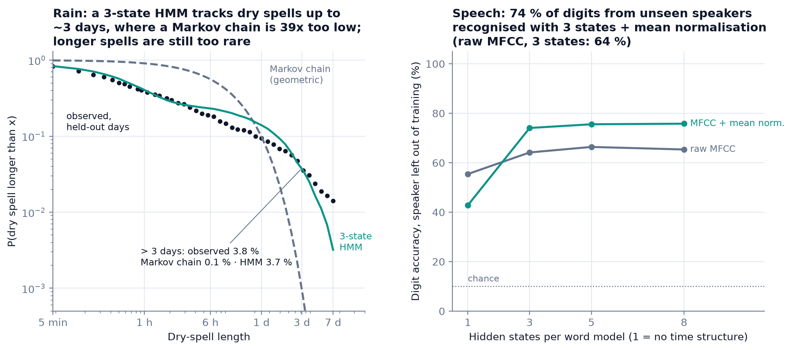
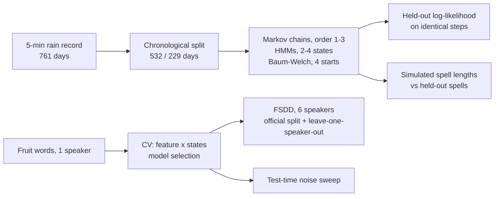
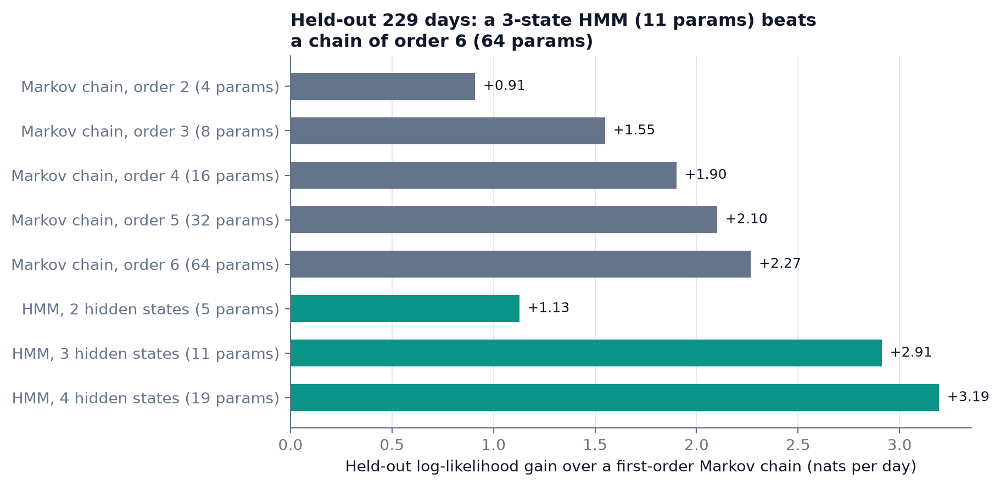
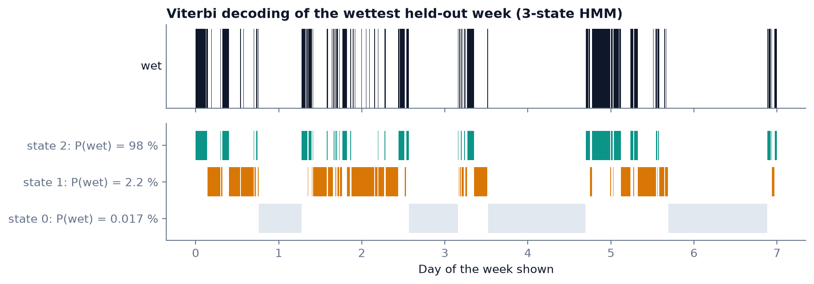
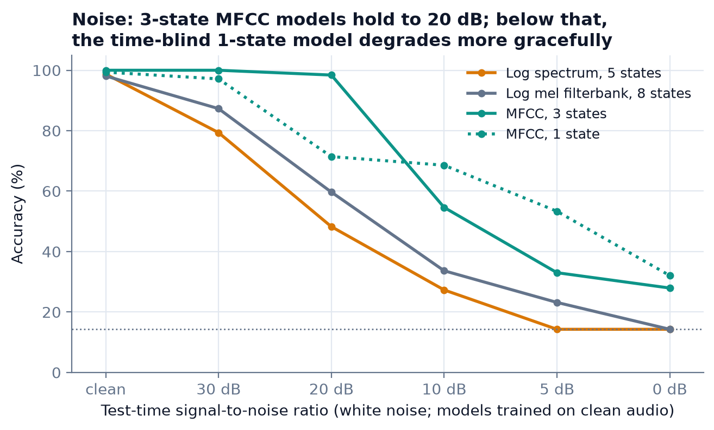
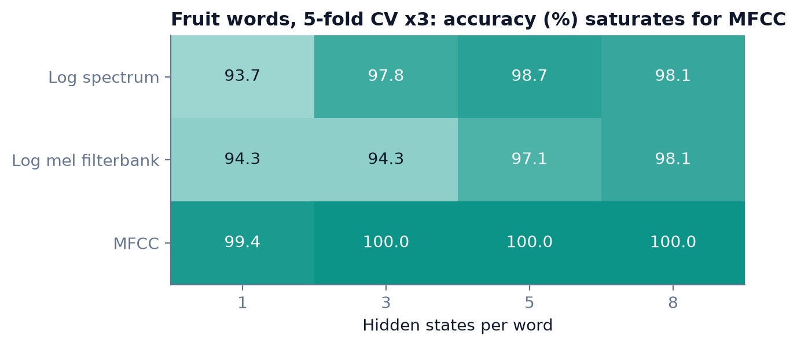

# tp-hmm-markov

Do hidden states earn their parameters? Markov chains and hidden Markov models written from scratch in NumPy, judged only on held-out data: 761 days of 5-minute rainfall, and spoken words from speakers the model has never heard.

[](https://github.com/Pchambet/tp-hmm-markov/actions/workflows/ci.yml)

[](LICENSE)
[](https://pchambet.github.io/tp-hmm-markov/)



## TL;DR

- **Rain spells.** A first-order Markov chain fitted to 532 days predicts that 0.06 % of dry spells last more than 3 days. Over the next 229 days, 3.8 % did. A 3-state HMM fitted to the same data predicts 3.6 %. The Kolmogorov-Smirnov distance to the held-out dry spells drops from 0.53 to 0.07.
- **It is not just extra parameters.** On held-out data, a 4-state HMM (19 parameters) gains 3.2 nats per day over the first-order chain, so the held-out record is about 25 times more likely each day. An order-3 chain (8 parameters) gains 1.6 nats per day, and a 3-state HMM (11 parameters) 2.9. Held-out log-loss falls from 80.1 to 64.0 millibits per 5-minute step (-20 %).
- **Speech, seen vs unseen speakers.** One HMM per word, with the feature set and state count chosen on a separate corpus. On the Free Spoken Digit Dataset it scores 93.0 % on the official split, where test speakers also appear in training. With the test speaker left out entirely, it drops to 64.2 %.
- **What closes part of that gap.** Removing each recording's mean cepstrum lifts unseen-speaker accuracy to 74.1 % with 3 states (worst speaker: 53.4 %). With a single state, the same normalisation drops accuracy to 42.8 %. Time structure and normalisation only help when used together.
- **Noise cuts both ways.** Under test-time white noise, the 3-state MFCC model holds 98 % at 20 dB, against 60 % for filterbank features and 48 % for the raw spectrum. At 10 dB and below, the time-blind 1-state model degrades more gracefully (69 % vs 55 % at 10 dB).

## Why it matters

Hidden-state models are the standard tool for anything that switches regime: weather, machine health, demand, speech. The useful question is not whether an HMM fits the training data better (it always does) but whether the hidden layer predicts unseen data better than a cheaper observable model of similar size, and where it breaks. In planning, the cost of rain or downtime sits in the long spells, so a model that gets the mean right but the tail wrong understates risk. This repository measures exactly that, and reports where the method loses.

## Approach



1. **Models.** Forward-backward, Baum-Welch and Viterbi in about 250 lines of NumPy (`src/hmm_markov/hmm.py`). Sequences of unequal length run as one padded batch, and the recursions stay stable for left-to-right models with extreme likelihood ratios. Tests check them against brute-force enumeration of every state path.
2. **Rain.** Binary wet/dry series: a 5-minute step counts as wet when it holds more than 0.1 of accumulated rain. The record is cut into weeks. Every model scores the same held-out steps, conditioned on the same three preceding symbols, so chains and HMMs share one likelihood scale. A test proves that an HMM with directly observed states scores exactly like a Markov chain.
3. **Words.** Log spectrum (129 dims), log mel filterbank (26) or MFCC (12) frames. One left-to-right diagonal-Gaussian HMM per word, with a flat-start initialisation. A recording is assigned to the word whose model gives the highest likelihood. The selection uses repeated 5-fold CV on the fruit corpus only, with ties going to fewer states; the selected setup is then run on FSDD, which played no part in the choice.

## Results


Every HMM with 3 or more states beats every observable chain on the 229 held-out days. The 2-state HMM sits between the order-2 and order-3 chains.

| Model | params | held-out log-loss (millibits/step) | KS dry | KS wet | P(dry > 3 days) |
|---|---:|---:|---:|---:|---:|
| Markov chain, order 1 | 2 | 80.1 | 0.527 | 0.233 | 0.06 % |
| Markov chain, order 3 | 8 | 72.3 | 0.350 | 0.124 | 0.5 % |
| HMM, 3 states | 11 | 65.5 | 0.074 | 0.176 | 3.6 % |
| HMM, 4 states | 19 | 64.0 | 0.075 | 0.031 | 3.8 % |
| Observed, held-out | | | | | 3.8 % |

The fourth state is spent on rain itself: two wet regimes instead of one bring the wet-spell KS distance from 0.18 down to 0.03.


The three states read as dry weather (it rains 0.02 % of the time), showery weather (2 %) and rain (98 %). In this week, many short dry gaps between rain bursts are decoded as showery weather rather than dry weather. That is how the model separates a pause in a storm from a genuinely dry period.


MFCC is the most noise-robust representation at every SNR tested. The ranking between 1 and 3 states flips below 20 dB, which is worth knowing before tuning a model on clean data only.


The selection corpus is saturated: 99.4 % with a single state, 100 % for MFCC with 3 or more. It picks a feature set, but it cannot separate model sizes. That is why the speaker-independent test on FSDD is the number to quote.

Full tables, interactive charts and per-speaker numbers are in the [report](https://pchambet.github.io/tp-hmm-markov/) and in `results/*.json`.

## Reproduce

```bash
make setup    # uv sync --locked (Python 3.12)
make data     # checks committed data, downloads FSDD v1.0.10 once (16 MB, verified)
make run      # both experiments: about 7 min (rain) + 9 min (words), single-threaded
make report   # docs/figures/*.png and site/index.html from results/*.json
make test     # 24 tests, < 10 s, no network
```

Disk: about 190 MB for the virtual environment and 26 MB for the downloaded FSDD recordings in `data/raw/` (gitignored). All randomness is seeded (`--seed`, default 0), and the committed results came from that seed.

## Repository layout

```
src/hmm_markov/
  hmm.py        forward-backward, Baum-Welch, Viterbi; categorical and diagonal-Gaussian emissions
  markov.py     k-th order chains, stationary law, spell lengths
  features.py   log spectrum, log mel filterbank, MFCC
  rain.py       experiment 1 (spells, held-out likelihood)
  words.py      experiment 2 (CV selection, FSDD, noise)
  report.py     figures and the static report page
  cli.py        `uv run hmm-markov {data,rain,words,report,all}`
tests/          brute-force checks, parameter recovery, hand-computed cases
data/           RR5MN.mat (rain record), fruits/ (7 words x 15 recordings); raw/ is downloaded
results/        experiment outputs (JSON) behind every number above
coursework/     the original course notebooks, instructor scripts and LaTeX report (archived)
```

## Methodology notes and limitations

- **One rain gauge, location undocumented.** 761 consecutive days from the course material; the indicator is re-derived from the stored accumulations and checked. The held-out period is the last 229 days, so it covers a different mix of seasons than the training period. That is a harder test than a random split, and also a noisier one.
- **The HMM tail is better, not right.** Beyond about 3 days, the 3-state HMM thins out faster than the record: dry spells longer than 7 days are 0.4 % simulated vs 1.4 % observed. Its slowest state still has a geometric tail. Explicit-duration (semi-Markov) models would be the next step.
- **EM finds local optima.** Each HMM is the best of 4 starts. For every state count, the best and worst final training log-likelihood differ by less than 0.1 nats, but a global optimum is not guaranteed.
- **Spell-length metrics compare simulations with one realisation.** Simulations run for 3x the record length. The KS distances and tail probabilities carry sampling noise of the held-out record itself (423 dry spells), so differences of a few hundredths of KS are not meaningful.
- **Speech corpora are small.** 105 fruit recordings from one speaker, and 3,000 FSDD recordings from 6 speakers: the leave-one-speaker-out figure averages 6 numbers, ranging from 53 % to 96 %. The pipeline has no deltas, no mixture emissions and no language model. It is a clean baseline, not a competitive recogniser.
- **The noise test uses synthetic white noise** at the utterance's average power, which includes silence. Real noise is coloured and non-stationary.

### About the coursework

This started as a Telecom SudParis lab on Markov models (2025). The instructor provided the audio feature code, the HMM wrapper around `pomegranate`, the rain record and the fruit recordings. The archived notebooks in `coursework/` are my lab answers and are kept as submitted (only data paths were updated). They contain errors that this package fixes, listed here for transparency:

- Part 1 reuses variable names across cells, so its final stationary-distribution check mixes two parameterisations.
- In part 2, the `pomegranate` Baum-Welch stopped after 3 iterations, the last with a negative improvement. The resulting model rains 1.0 % of the time, against 4.2 % observed.
- Part 3 fails on a `pomegranate` API mismatch and never produced accuracy numbers.

Everything above the coursework section is new code written for this repository, and it does not depend on `pomegranate`.

## References

- L. R. Rabiner, "A tutorial on hidden Markov models and selected applications in speech recognition", *Proc. IEEE* 77(2), 1989.
- K. R. Gabriel and J. Neumann, "A Markov chain model for daily rainfall occurrence at Tel Aviv", *Q. J. R. Meteorol. Soc.* 88, 1962.
- J. P. Hughes, P. Guttorp and S. P. Charles, "A non-homogeneous hidden Markov model for precipitation occurrence", *J. R. Stat. Soc. C* 48(1), 1999.
- S. B. Davis and P. Mermelstein, "Comparison of parametric representations for monosyllabic word recognition in continuously spoken sentences", *IEEE Trans. ASSP* 28(4), 1980.
- Z. Jackson et al., Free Spoken Digit Dataset v1.0.10, [github.com/Jakobovski/free-spoken-digit-dataset](https://github.com/Jakobovski/free-spoken-digit-dataset), CC BY-SA 4.0 (downloaded, not redistributed here).

---

Built by [Pierre Chambet](https://github.com/Pchambet) — decision science for operations under uncertainty.
